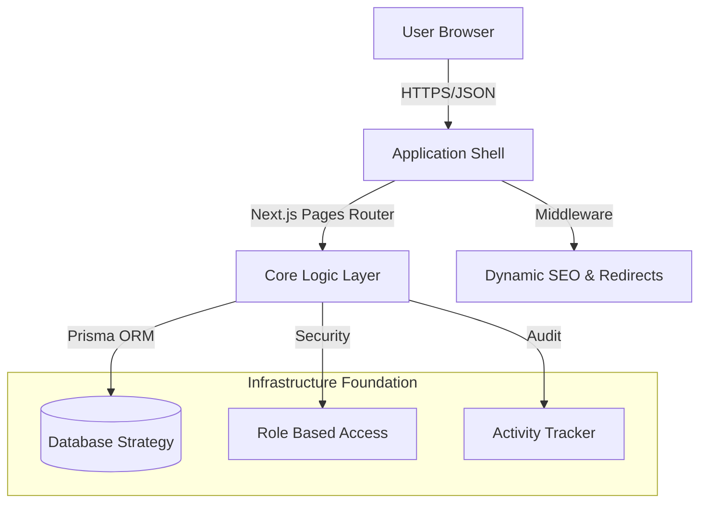

# ⚙️ Technical Specs & Infrastructure

[🏠 Home](../README.md) | [🇷🇺 Russian Version](./ARCHITECTURE.ru.md)

---

## 🏗️ System Topology



## 🛠️ Infrastructure Deep Dive

### 1. Data Modeling & Persistence
The architecture utilizes **Prisma** as its primary ORM, promoting a "Schema-First" approach. The current preview showcases a robust data model capable of handling complex tour configurations, user roles, and detailed activity logging.

- **Prisma Engine:** Optimized for type-safe queries and automated migrations.
- **Dynamic Schemas:** Supporting extensible metadata for tours and SEO overrides.

### 2. Component Architecture
Happy Tour leverages a modular component design. By separating UI logic into a centralized `components/ui/` directory, the system ensures a "Single Source of Truth" for styling and interactivity using **Chakra UI** and **Tailwind CSS**.

- **Atomic Design:** Small, reusable components forming complex page layouts.
- **Framer Motion:** High-end micro-animations integrated into core UI elements.

### 3. Security & Validation (Zod)
Everything that enters the API layer is strictly validated. The project demonstrates advanced use of **Zod** to enforce runtime types and provide clear error feedback.

```typescript
// Example Architectural Pattern (See lib/schemas.js)
export const TourSchema = z.object({
  title: z.string().min(3),
  price: z.number().positive(),
  published: z.boolean(),
});
```

---

## 🔐 Standards & Quality Gates

- **Strict TypeScript:** High compliance with type safety to minimize runtime errors.
- **Middleware Safety:** Integrated URL sanitization and automated 301/302 management to preserve SEO link juice.
- **Audit Logs:** Every destructive action is captured in the `ActivityLog` model, ensuring enterprise-grade accountability.

---

<br /> <p align="center"> <b><a href="https://avpdev.com/en/">Alexios Odos</a></b> &nbsp;|&nbsp; <b><a href="https://avpdev.com/ru/">Aliaksei Patskevich</a></b> <br /> <sub> Senior Full-stack Engineer <br /> <a href="https://github.com/AVP-Dev">GitHub</a> &bull; <a href="https://t.me/AVP_Dev">Telegram</a> </sub> </p>
