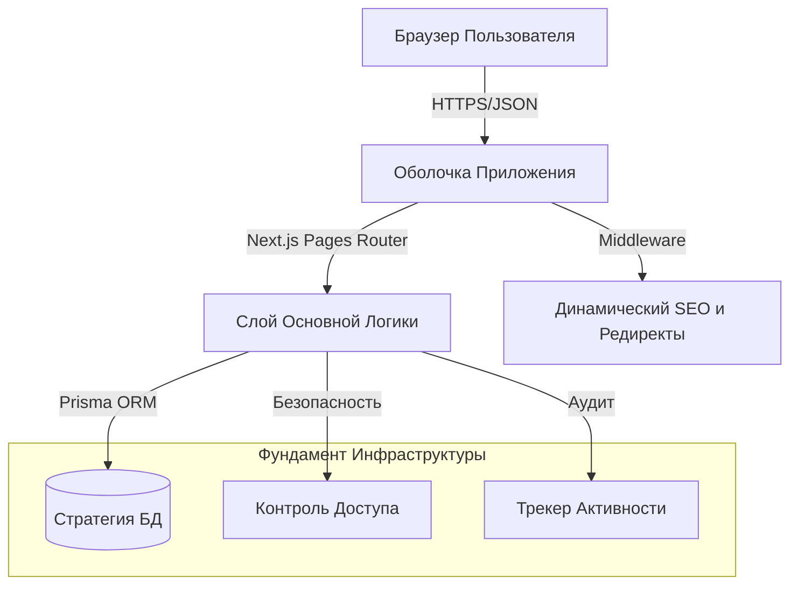

# ⚙️ Технические Спецификации и Инфраструктура

[🏠 Главная](../README.ru.md) | [🇺🇸 English Version](./ARCHITECTURE.md)

---

## 🏗️ Топология Системы



## 🛠️ Глубокое погружение в Инфраструктуру

### 1. Моделирование и Хранение Данных
Архитектура использует **Prisma** в качестве основной ORM, придерживаясь подхода "Schema-First". Данное превью демонстрирует надежную модель данных, способную обрабатывать сложные конфигурации туров, пользовательские роли и детальное логирование активности.

- **Prisma Engine:** Оптимизирован для типобезопасных запросов и автоматизированных миграций.
- **Динамические Схемы:** Поддержка расширяемых метаданных для туров и SEO-переопределений.

### 2. Компонентная Архитектура
Happy Tour использует модульный дизайн компонентов. Размещая логику UI в централизованной директории `components/ui/`, система обеспечивает наличие "Единого источника правды" для стилей и интерактивности с использованием **Chakra UI** и **Tailwind CSS**.

- **Атомарный Дизайн:** Маленькие, переиспользуемые компоненты, формирующие сложные макеты страниц.
- **Framer Motion:** Премиальные микро-анимации, интегрированные в основные элементы интерфейса.

### 3. Безопасность и Валидация (Zod)
Все данные, попадающие в слой API, проходят строгую валидацию. Проект демонстрирует продвинутое использование **Zod** для обеспечения типов времени выполнения и предоставления понятной обратной связи об ошибках.

```typescript
// Пример Архитектурного Паттерна (См. lib/schemas.js)
export const TourSchema = z.object({
  title: z.string().min(3),
  price: z.number().positive(),
  published: z.boolean(),
});
```

---

## 🔐 Стандарты и Качество

- **Строгий TypeScript:** Высокое соответствие типобезопасности для минимизации ошибок выполнения.
- **Безопасность Middleware:** Интегрированная санитизация URL и автоматизированное управление 301/302 редиректами для сохранения SEO-веса.
- **Логи Аудита:** Каждое деструктивное действие фиксируется в модели `ActivityLog`, что гарантирует подотчетность корпоративного уровня.

---

<br /> <p align="center"> <b><a href="https://avpdev.com/en/">Alexios Odos</a></b> &nbsp;|&nbsp; <b><a href="https://avpdev.com/ru/">Aliaksei Patskevich</a></b> <br /> <sub> Senior Full-stack Engineer <br /> <a href="https://github.com/AVP-Dev">GitHub</a> &bull; <a href="https://t.me/AVP_Dev">Telegram</a> </sub> </p>
